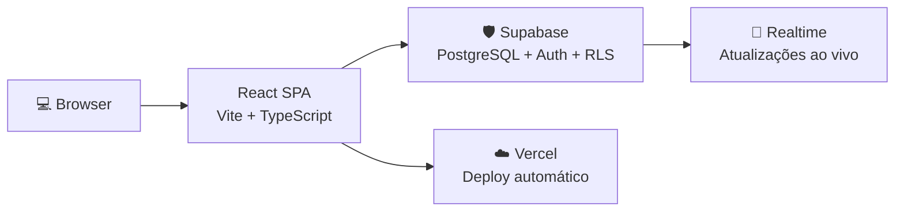

<div align="center">

# ⚙️ EDM Lean — SaaS de Produção para Eletroerosão a Fio

**Plataforma SaaS de gestão de produção industrial com Kanban e OEE automático.**
Desenvolvida com metodologia Lean para ferramentarias e usinagens de precisão.

[](https://www.edmlean.com.br/)


</div>

---

## 🔗 Links

| | Link |
|--|--|
| **Produção** | https://www.edmlean.com.br/ |
| **Repositório** | https://github.com/michelfioravante-alt/edm-lean |

---

## ✨ O que é

O **EDM Lean** resolve um problema real: ferramentarias e usinagens de precisão que operam máquinas de eletroerosão a fio (Wire EDM) ainda controlam produção em papel, planilhas ou quadros brancos. Isso gera perda de visibilidade, tempos mortos não rastreados e zero métricas de eficiência.

O EDM Lean digitaliza esse processo com:

- **📋 Quadro Kanban** — ordens de serviço visuais (Fila → Preparação → Em Corte → Inspeção → Concluído)
- **📊 OEE automático** — cálculo de Disponibilidade × Performance × Qualidade por máquina
- **⏱️ Registro de paradas** — tracking de setups, paradas não planejadas e tempos mortos
- **🏢 Multi-tenant** — organizações isoladas com convites por email/domínio
- **🔒 Segurança** — Row Level Security garantindo isolamento total entre empresas

---

## 🏭 Por que OEE?

O **OEE (Overall Equipment Effectiveness)** é o indicador padrão ouro da indústria para medir eficiência de máquinas. Ele combina três métricas:

```
OEE = Disponibilidade × Performance × Qualidade

• Disponibilidade: tempo de máquina ligada vs. paradas
• Performance: velocidade real vs. velocidade teórica
• Qualidade: peças boas vs. peças produzidas
```

Sem medição, não há melhoria. O EDM Lean automatiza essa medição para que gestores tomem decisões baseadas em dados, não em intuicão.

---

## 🏗️ Arquitetura



---

## 🛠️ Tech Stack

| Camada | Tecnologia |
|:-------|:-----------|
| Frontend | React + TypeScript |
| Build | Vite |
| Estilização | Tailwind CSS |
| Backend | Supabase (PostgreSQL + Auth + Realtime) |
| Segurança | Row Level Security (RLS) |
| Deploy | Vercel |

---

## 🔒 Segurança Multi-tenant

- **RLS (Row Level Security)** em todas as tabelas
- Cada organização acessa apenas seus próprios dados
- Convites por email com validação de domínio
- Isolação completa de dados entre empresas no nível do banco

---

## 🚀 Como Rodar

```bash
git clone https://github.com/michelfioravante-alt/edm-lean.git
cd edm-lean
npm install
npm run dev
```

Variáveis de ambiente em `.env.example`.

---

## 🎓 Aprendizados Técnicos

- Aplicação de conceitos **Lean Manufacturing** em software (fluxo puxado, visão Kanban, eliminação de desperdícios)
- Modelagem de **OEE em banco relacional** com cálculos automáticos por máquina e período
- Arquitetura **multi-tenant com RLS** — isolamento no nível do PostgreSQL sem microserviços
- **Supabase Realtime** para atualizações instantâneas entre operadores e gestores
- Sistema de **convites e permissões** por organização

---

## 📄 Licença

Código aberto para **avaliação de portfólio**; produto em uso em https://www.edmlean.com.br/
